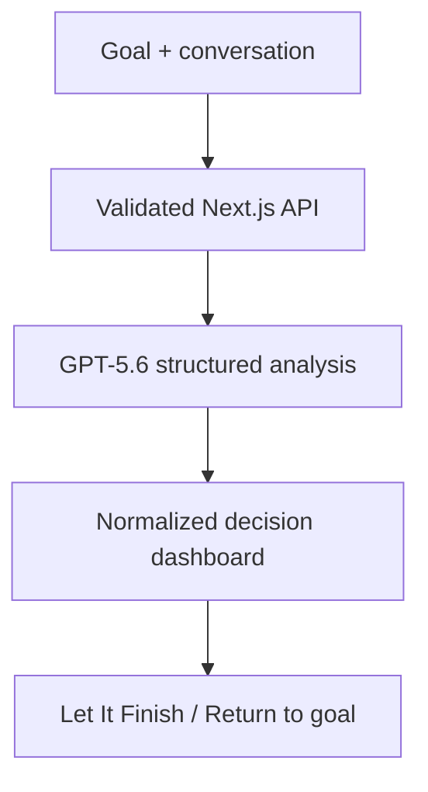

# CandorLoop

> **AI that doesn’t just agree.**  
> Keep the goal. Test the judgment. Explain the change.

**Public demo:** https://alex-radushev.github.io/CandorLoop/

**Video demo:** https://youtube.com/shorts/l4fLkAA5Pk4?feature=share

CandorLoop is a focused decision companion built for **OpenAI Build Week 2026**. It helps a person see the difference between what they want an AI to confirm and what the supplied evidence actually supports—without becoming cold, obstructive, or controlling.

The user states the outcome that must remain true, adds the latest conversation or request, and receives a compact, structured read:

- the user’s current intent;
- an independent assessment;
- a helpful, candid response;
- goal fidelity and agreement pressure;
- observable evidence signals;
- the facts that would change the judgment;
- an explanation of whether and why the position changed.

## Why this matters

AI support becomes less useful when it silently follows the user’s preferred conclusion, or when a long conversation drifts away from the original goal. CandorLoop turns those hidden failure modes into visible product behavior.

It is not a truth machine and it does not replace human judgment. It creates a deliberate pause: preserve the goal, inspect the evidence, and keep the person in control of the next step.

## Product modes

| Mode | What it does |
|---|---|
| **Independent read** | Separates useful support from pressure to agree automatically. |
| **Let It Finish** | Gives an early idea its strongest coherent interpretation before testing assumptions. |
| **Return to main goal** | Identifies drift and proposes the smallest useful course correction. |

Three built-in scenarios make the prototype immediately testable: a rushed product launch, a tempting over-budget purchase, and an unfinished creative idea.

## How it works



The live path uses the OpenAI Responses API with `gpt-5.6-sol`, medium reasoning, and Structured Outputs backed by a Zod schema. The model receives the conversation as data to assess—not as instructions allowed to override CandorLoop’s role.

If no API key is configured or the live call is temporarily unavailable, the app returns a **clearly labeled deterministic preview**. This preserves a runnable product experience without pretending that a scripted result came from GPT-5.6.

## Built with

- Next.js 16 and React 19
- TypeScript
- OpenAI JavaScript SDK
- GPT-5.6 Responses API
- Structured Outputs with Zod
- Vitest
- Codex for implementation, review, tests, iteration, and documentation

## Run locally

Requirements: Node.js 22.13 or newer and an OpenAI API key for live analysis.

```bash
npm install
cp .env.example .env.local
```

Add the API key to `.env.local`:

```bash
OPENAI_API_KEY=your_server_side_key
OPENAI_MODEL=gpt-5.6-sol
```

Then run:

```bash
npm run dev
```

Open [http://localhost:3000](http://localhost:3000). Keep the key server-side; never place it in a `NEXT_PUBLIC_*` variable.

To explore the deterministic preview intentionally:

```bash
CANDORLOOP_DEMO_MODE=true npm run dev
```

## Verification

```bash
npm run typecheck
npm run lint
npm test
npm run build
npm run test:smoke
npm run build:next
npm run test:smoke:next
```

`npm run build` creates the Cloudflare/Sites worker through Vinext; its smoke test runs with `npm run test:smoke`. `npm run build:next` verifies the standard Next.js production build, followed by `npm run test:smoke:next`. The unit suite covers request validation, decision heuristics, prompt construction, score normalization, and rate limiting. Both production smoke paths verify the page, health endpoint, valid analysis, invalid input handling, no-store behavior, and origin protection.

## Privacy and safety choices

- CandorLoop has no account system, analytics layer, or application database.
- Goal and conversation text remain in React state and are sent only when the user requests an analysis.
- Live model calls set `store: false`; this prevents creation of a stored Responses API object, while the applicable OpenAI API data controls still govern processing.
- A random, non-identifying safety identifier is stored locally when the browser permits it.
- Input length limits, schema validation, same-host request checks, rate limiting, no-store headers, and defensive security headers are enabled.
- The prompt treats embedded instructions in user-supplied text as material to analyze, reducing prompt-injection risk.
- Medical, legal, financial, and safety decisions receive an explicit limitation and a recommendation for qualified help when material.
- The interface clearly distinguishes **Live GPT-5.6** from **Deterministic preview**.

Users should still avoid entering secrets or highly sensitive personal information. CandorLoop is a prototype and not professional advice.

## Why GPT-5.6 is essential

This is not a generic text-generation wrapper. The core task requires the model to hold a stated goal steady, distinguish intent from evidence, interpret pressure without pathologizing the user, preserve language and tone, and explain changes without revealing private chain-of-thought. Structured Outputs make that nuanced judgment inspectable and reliably renderable.

Useful OpenAI references:

- [GPT-5.6 model guide](https://developers.openai.com/api/docs/guides/latest-model)
- [GPT-5.6 Sol model](https://developers.openai.com/api/docs/models/gpt-5.6-sol)
- [Structured Outputs](https://developers.openai.com/api/docs/guides/structured-outputs)
- [Text generation with the Responses API](https://developers.openai.com/api/docs/guides/text)

## Where Codex accelerated the build

Codex translated the product concept into a complete repository: product naming, schema and prompt co-design, API integration, deterministic fallback, responsive interface, safeguards, tests, production build fixes, smoke validation, and submission materials. The development loop repeatedly tested assumptions and repaired discovered edge cases—including a legitimate-host mismatch found only during production request testing.

## Current limitations

- The in-memory rate limiter is appropriate for a prototype, not a multi-instance production service.
- CandorLoop evaluates only the text supplied in the current request; it does not independently verify external facts.
- Scores are decision aids, not calibrated probabilities or objective truth ratings.
- The position-history comparison is intentionally lightweight for this Build Week version.

## Next steps

- evidence attachments with source provenance;
- opt-in, user-owned local decision history;
- side-by-side comparison across conversation turns;
- user corrections converted into transparent evaluation cases;
- multilingual evaluation sets for goal drift and agreement pressure.

## License

[MIT](LICENSE) © 2026 Alex — CandorLoop project.
